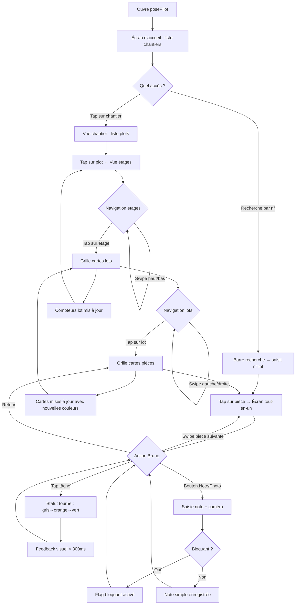
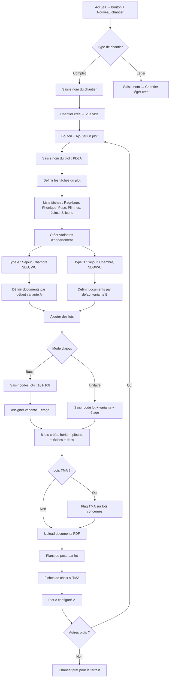
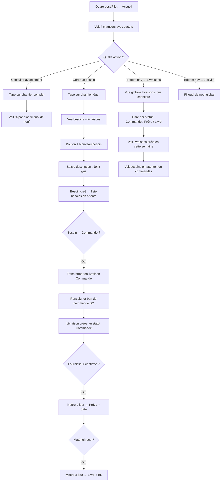

# UX Design Specification posePilot

**Author:** Youssef
**Date:** 2026-02-05

---

## Executive Summary

### Project Vision

posePilot est une PWA mobile-first de suivi de chantier ultra-spécialisée pour les entreprises de pose de carrelage/faïence travaillant avec des promoteurs immobiliers. L'application remplace une V1 surchargée par un outil qui suit le professionnel sur le terrain — pas un logiciel qui le dirige depuis le bureau.

Deux modes de fonctionnement coexistent : le chantier complet (lots, plots, tâches, documents, inventaire) et le chantier léger (besoins et livraisons uniquement). Les deux partagent un socle commun de gestion des besoins et livraisons.

Philosophie directrice : zéro superflu, confiance au savoir-faire du poseur, champs optionnels jamais bloquants, simplicité absolue testée par l'utilisateur le moins tech de l'équipe.

### Target Users

**Bruno — Le terrain au quotidien (utilisateur principal)**
Chef d'équipe terrain, profil tech basique, smartphone Samsung. Sur le chantier tous les jours dans des conditions réelles (froid, gants, réseau variable). Il est le test ultime de la simplicité : si Bruno utilise l'app de sa propre initiative sans qu'on le lui demande, le produit est réussi. Usage quotidien intensif — c'est l'utilisateur que chaque décision UX doit servir en priorité.

**Youssef — Le pilote bureau/terrain (utilisateur principal)**
Futur conducteur de travaux, profil tech intermédiaire. Configure les chantiers au bureau (variantes, templates, documents), supervise l'avancement à distance, gère les livraisons. Se rend sur le terrain occasionnellement. A besoin d'une vision d'ensemble sans appeler Bruno.

**Persona 3 (potentiel)**
Futur chef d'équipe terrain, profil similaire à Bruno. Confirme que la simplicité doit être le standard, pas l'exception.

### Key Design Challenges

1. **Conditions terrain exigeantes** : Doigts épais/gants, écran mouillé ou poussiéreux, luminosité variable, réseau 3G intermittent. Chaque interaction doit être physiquement possible et visuellement lisible dans ces conditions.

2. **Profondeur hiérarchique vs rapidité d'accès** : 5 niveaux de navigation (Chantier → Plot → Étage → Lot → Pièce) à rendre accessibles en 2-3 taps grâce à la recherche rapide et une navigation descendante fluide.

3. **Dualité chantier complet / léger** : Deux structures très différentes qui doivent cohabiter dans une interface cohérente et prévisible, sans complexifier l'expérience de l'une pour accommoder l'autre.

4. **Deux contextes d'usage** : Configuration bureau (puissante, guidée) vs usage terrain (ultra-rapide, minimal). Le setup ne doit jamais contaminer la simplicité terrain.

5. **Standard "zéro explication"** : Chaque écran doit être évident au premier regard pour un utilisateur au profil tech basique. Aucun onboarding, aucun tutoriel.

### Design Opportunities

1. **Le tap-cycle comme signature UX** : Le cycle de statut réversible d'un seul tap (gris → orange → vert) peut devenir le geste iconique de posePilot — simple, mémorisable, utilisé 50+ fois par jour.

2. **Les grilles colorées comme langage visuel** : Des cartes colorées par statut à chaque niveau hiérarchique permettent une lecture instantanée de l'avancement sans lire un seul chiffre.

3. **Le swipe entre pièces** : Mime le parcours physique d'une pièce à l'autre dans l'appartement. Navigation naturelle qui élimine les allers-retours.

4. **L'écran pièce tout-en-un** : Tâches + notes + photos sur un seul écran — l'écran le plus utilisé, conçu pour que Bruno voie tout et agisse sur tout sans navigation supplémentaire.

## Core User Experience

### Defining Experience

**Boucle primaire — La validation terrain :**
L'action centrale de posePilot est indissociablement double : Bruno valide les tâches sur le terrain (action), Youssef voit l'avancement mis à jour au bureau (résultat). Les deux faces d'une même pièce. Chaque tap de Bruno sur une tâche nourrit instantanément la vision globale de Youssef. C'est cette boucle validation → visibilité qui fait de posePilot la source de vérité partagée.

Le geste critique : arriver sur un lot, voir les tâches d'une pièce, taper pour valider, swiper vers la pièce suivante, passer au lot suivant. Bruno fait cette boucle 50+ fois par jour — elle doit être fluide au point de devenir un réflexe musculaire.

### Platform Strategy

**PWA mobile-first, installable :**
- Chrome Android (Samsung de Bruno) — priorité absolue
- Safari iOS — support secondaire
- Chrome Desktop — support secondaire pour la configuration bureau
- Installable sur l'écran d'accueil (display: standalone), indistinguable d'une app native
- Pas de mode hors ligne — toujours connecté
- Compression photos côté client pour réseau 3G
- Synchronisation temps réel entre utilisateurs

**Contexte d'utilisation physique :**
- Smartphone tenu d'une main, souvent avec gants
- Luminosité variable (sous-sol sombre ↔ plein soleil)
- Réseau 3G intermittent en zone de chantier
- Sessions courtes et fréquentes (30 secondes à 3 minutes par lot)

### Effortless Interactions

**1. Navigation gestuelle par couches :**
Le système de navigation repose sur des gestes cohérents adaptés au niveau hiérarchique :
- **Dans un lot (vue pièce)** : swipe gauche/droite → naviguer entre les pièces
- **Dans un étage (vue lots)** : swipe gauche/droite → naviguer entre les lots
- **Dans un plot (vue étages)** : swipe haut/bas → monter ou descendre d'un étage (haut = monter, bas = descendre — métaphore physique)

Le contexte visuel de chaque écran doit rendre évident le niveau de navigation actuel, pour que Bruno sache toujours ce que le swipe va faire.

**2. Le tap-cycle de statut :**
Un seul tap fait tourner le statut : pas commencé (gris) → en cours (orange) → fait (vert) → retour à pas commencé. Réversible, sans confirmation, sans popup. Le feedback visuel est immédiat (< 300ms).

**3. Recherche par numéro de lot :**
Bruno connaît toujours le numéro du lot (inscrit physiquement sur place). La recherche doit être accessible en permanence et retourner un résultat en < 1 seconde.

**4. Retour naturel à la vue étage :**
Quand Bruno a terminé un lot, il revient à la vue étage qui affiche la grille de tous les lots avec leurs couleurs mises à jour. Il voit immédiatement l'impact de son travail et choisit le lot suivant.

### Critical Success Moments

**Moment 1 — Le premier tap :**
Bruno ouvre l'app, tape sur un chantier, arrive sur un lot, tape sur une tâche — le statut change instantanément avec un retour visuel satisfaisant. En moins de 10 secondes, il a fait quelque chose d'utile. C'est le moment où il se dit "c'est rapide, ça marche."

**Moment 2 — La fin de tournée :**
Après 3 heures de visite, Bruno a mis à jour 15 lots. Il revient à la vue chantier et voit le pourcentage d'avancement qui a bougé. Le sentiment de progression visible et tangible.

**Moment 3 — Le premier réflexe partagé :**
Youssef et Bruno discutent d'un lot — leur premier réflexe est d'ouvrir posePilot. La photo du blocage est là, le contexte est là. L'app est devenue la référence commune.

**Moment 4 — Le retour de confiance :**
Bruno tape sur le mauvais statut. Il retape — corrigé en 1 seconde. Aucune conséquence. Il sait que l'app ne le piègera jamais. Cette confiance transforme l'outil en allié.

### Experience Principles

1. **Terrain d'abord** : Chaque décision de design est validée par le test Bruno — un utilisateur au profil tech basique, sur un chantier, avec des gants, en 30 secondes. Si ça ne passe pas ce test, on simplifie.

2. **Un tap, un résultat** : Chaque interaction produit un résultat visible immédiat. Pas de formulaire, pas de confirmation, pas de popup. L'action et le feedback sont indissociables.

3. **La couleur parle** : Le langage visuel (grilles colorées, indicateurs de statut) remplace le texte partout où c'est possible. Bruno n'a pas besoin de lire — il voit.

4. **Le geste suit le mouvement** : La navigation gestuelle reflète le monde physique. Swiper entre les pièces = marcher d'une pièce à l'autre. Swiper vers le haut = monter un étage. Le digital mime le réel.

5. **Confiance par la réversibilité** : Chaque action est annulable d'un tap. Aucune action irréversible en usage terrain. L'app pardonne les erreurs — Bruno n'a jamais peur de taper.

## Desired Emotional Response

### Primary Emotional Goals

**Pour Bruno (terrain) — L'invisibilité de l'outil :**
L'objectif émotionnel ultime est l'absence d'émotion. L'app doit être si transparente, si naturelle qu'elle disparaît de la conscience. Bruno ne pense pas à posePilot — il fait son travail, et l'app suit. Comme un bon outil de chantier : on ne pense pas au marteau quand on plante un clou. L'utilité pure, sans friction émotionnelle.

Bruno revient chaque jour non pas parce que l'app est agréable ou parce qu'il y est obligé, mais parce qu'elle est **utile**. Elle lui évite d'oublier des choses, point.

**Pour Youssef (bureau) — Contrôle et fierté :**
Ouvrir l'app et voir l'avancement mis à jour, les couleurs qui changent, les lots qui progressent. Le sentiment de maîtrise : "je sais où en sont mes chantiers." La fierté de l'outil qui fonctionne, qui tient ses promesses.

### Emotional Journey Mapping

| Moment | Bruno (terrain) | Youssef (bureau) |
|--------|----------------|-----------------|
| **Ouvre l'app** | Neutre — geste automatique | Curiosité — "qu'est-ce qui a bougé ?" |
| **Navigue vers un lot** | Neutre — fluide, sans réfléchir | Contrôle — "je trouve tout" |
| **Valide une tâche** | Rien — transparent comme respirer | — |
| **Voit l'avancement** | — | Fierté + sérénité |
| **Fait une erreur** | Léger soulagement — "facile à corriger" | Léger soulagement |
| **Prend une photo blocage** | Utilité — "c'est noté, je passe à autre chose" | — |
| **Consulte le fil "quoi de neuf"** | — | Confiance — "je suis au courant" |
| **Ferme l'app** | Rien — passage naturel à la suite | Sérénité — "tout est sous contrôle" |

### Micro-Emotions

**Émotions cibles :**
- **Confiance** plutôt que doute : chaque écran est immédiatement compréhensible
- **Fluidité** plutôt que friction : chaque geste produit le résultat attendu
- **Soulagement** en cas d'erreur : corriger est toujours trivial
- **Utilité ressentie** : chaque interaction a un impact concret et visible

**Émotion cardinale à éliminer : l'incompréhension.**
Quand Bruno regarde un écran et ne comprend pas ce qu'il voit, ce qu'il doit faire, ou ce que signifie un élément — c'est un échec de design. Pas la lenteur, pas la complexité technique, pas la frustration. L'incompréhension. C'est le signal d'alarme absolu.

### Design Implications

| Émotion visée | Implication UX |
|---------------|----------------|
| **Invisibilité (Bruno)** | Zéro décoration superflue, zéro animation gratuite, zéro texte inutile. Chaque pixel sert. L'interface s'efface derrière la tâche. |
| **Contrôle (Youssef)** | Vues d'ensemble avec agrégation claire, indicateurs visuels fiables, fil d'activité récente. L'information vient à lui. |
| **Fierté (Youssef)** | Progression visible et tangible — pourcentages qui montent, couleurs qui virent au vert. Le travail de l'équipe rendu visible. |
| **Soulagement (erreur)** | Tap-cycle réversible, pas de confirmation pour les actions courantes, pas de conséquence irréversible en usage terrain. |
| **Anti-incompréhension** | Chaque élément visuel a un sens évident. Les couleurs sont cohérentes partout. Les labels sont courts et concrets. Le contexte de navigation est toujours visible (où suis-je ?). |

### Emotional Design Principles

1. **L'outil invisible** : Le meilleur design émotionnel pour un outil terrain, c'est quand l'utilisateur ne pense pas au design. L'app disparaît — seul le travail reste.

2. **L'utilité comme émotion** : Bruno ne cherche pas du plaisir dans l'app. Il cherche à ne rien oublier. Le sentiment d'utilité ("ça m'a servi") est la seule émotion qui garantit son retour.

3. **Zéro incompréhension** : Si un utilisateur hésite, c'est un bug de design. Chaque écran doit être auto-explicatif pour un profil tech basique. Pas de jargon UI, pas de pictogrammes ambigus, pas de logique cachée.

4. **Le soulagement plutôt que la peur** : Les erreurs se corrigent d'un tap. L'app ne punit jamais, ne demande jamais "êtes-vous sûr ?" pour les actions courantes. La réversibilité crée la confiance.

5. **La progression visible** : Les couleurs qui changent, les compteurs qui montent — c'est le fil émotionnel de Youssef. La visibilité du travail accompli nourrit la fierté et le sentiment de contrôle.

## UX Pattern Analysis & Inspiration

### Inspiring Products Analysis

**WhatsApp — Le socle de familiarité (pattern dominant)**
L'app que Bruno utilise le plus au quotidien. Ce qui la rend maîtrisable sans formation : navigation par listes verticales simples, tap sur un élément pour y entrer, indicateurs visuels compacts (coches grises/bleues pour le statut), gros boutons d'action flottants, retour arrière toujours prévisible. WhatsApp ne demande jamais "êtes-vous sûr ?", ne cache rien derrière des menus profonds, et fonctionne même en réseau dégradé. C'est la langue UX que Bruno parle — posePilot doit parler la même.

**Appareil photo natif — L'outil invisible**
L'app Caméra du smartphone : ouverture instantanée, prête à l'action, zéro menu. Le bouton principal est énorme, central, évident. C'est le modèle de l'écran qui n'a pas besoin d'explication — l'action principale saute aux yeux. Pour posePilot : chaque écran a une vocation claire et une action principale immédiatement identifiable.

**Trello/Kanban visuel — Le langage des cartes**
Des cartes disposées en grille, chacune portant un indicateur d'état par la couleur. Un coup d'œil suffit pour comprendre la situation globale sans lire un seul texte. Ce pattern est idéal pour les vues étage (grille de lots) et lot (grille de pièces) de posePilot.

**Apps fitness (Podomètre) — Le feedback de progression**
Progression visualisée de façon immédiate : un chiffre gros et lisible, une couleur qui évolue, un cercle qui se remplit. Ce pattern sert le besoin de Youssef au bureau — voir l'avancement de ses chantiers d'un coup d'œil avec des indicateurs visuels forts.

### Transferable UX Patterns

**Navigation :**
- **Listes verticales façon WhatsApp** → écran d'accueil (liste des chantiers), liste des plots, liste des étages. Familier pour Bruno, prévisible.
- **Grille de cartes façon Trello** → vue étage (lots en cartes), vue lot (pièces en cartes). Lecture instantanée par la couleur.
- **Navigation linéaire descendante** → tap pour entrer, bouton retour ou swipe pour remonter. Jamais de menu latéral caché.

**Interaction :**
- **Tap-cycle façon toggle switch** → un tap change l'état, un autre tap le change encore. Simple, réversible, mémorisable. Inspiré des interrupteurs on/off.
- **Bouton d'action flottant façon WhatsApp** → action principale (nouvelle note, photo) toujours accessible via un bouton flottant visible.
- **Swipe façon navigation entre pages** → swipe gauche/droite entre pièces (dans un lot) et entre lots (dans un étage), swipe haut/bas entre étages.

**Visuel :**
- **Indicateurs de statut compacts façon WhatsApp** → compteurs "X faits / Y en cours" affichés directement sur chaque carte, sans ouvrir l'élément.
- **Progression par couleur façon fitness** → gris (pas commencé), orange (en cours), vert (terminé), rouge (bloqué). Cohérent à tous les niveaux.

### Anti-Patterns to Avoid

1. **Le formulaire multi-champs (apps BTP génériques)** : Créer un problème = remplir 8 champs obligatoires. Pour posePilot : jamais de formulaire pour l'usage terrain. Un tap, une photo, un texte libre. L'information minimale qui a de la valeur.

2. **Le menu hamburger profond** : Cacher la navigation derrière des menus déroulants à plusieurs niveaux. Bruno ne fouille pas — il abandonne. Pour posePilot : navigation visible, directe, toujours accessible.

3. **Les confirmations systématiques** : "Êtes-vous sûr de vouloir changer le statut ?" × 50 fois par jour = 50 frictions inutiles. Pour posePilot : les actions courantes terrain sont immédiates et réversibles, jamais bloquées par une confirmation.

4. **Le dashboard surchargé** : Trop de métriques, trop de graphiques, trop d'informations sur un seul écran. Pour posePilot : chaque écran a un focus clair. L'information détaillée est accessible en profondeur, pas étalée en surface.

5. **L'onboarding forcé** : Tutoriels en 5 étapes, tooltips qui bloquent l'écran, coachmarks intrusifs. Pour posePilot : zéro onboarding. Si l'interface a besoin d'être expliquée, c'est l'interface qui a un problème.

### Design Inspiration Strategy

**Adopter :**
- La navigation par listes/cartes façon WhatsApp comme structure principale
- Les indicateurs de statut compacts et colorés à chaque niveau
- Le principe de l'action principale immédiatement visible par écran
- Le bouton d'action flottant pour les actions secondaires fréquentes

**Adapter :**
- Le swipe de navigation (entre pièces, lots, étages) — adapter à la hiérarchie spécifique de posePilot avec des métaphores physiques (haut/bas = monter/descendre d'étage)
- Les grilles Kanban — simplifier pour des cartes avec indicateur couleur + compteur texte, sans la complexité du drag & drop

**Refuser :**
- Tout formulaire multi-champs en usage terrain
- Toute navigation cachée ou profonde (menu hamburger, onglets secondaires)
- Toute confirmation pour les actions courantes réversibles
- Tout onboarding explicite ou tutoriel intégré

## Design System Foundation

### Design System Choice

**Tailwind CSS + shadcn/ui** — Design system utilitaire avec composants headless personnalisables.

### Rationale for Selection

1. **Liberté totale de design** : Aucune convention visuelle imposée. Chaque composant est sculpté sur mesure pour les besoins terrain de posePilot — taille des boutons, espacement, couleurs, tout est décidé par le projet, pas par un framework.

2. **Zéro superflu technique** : Tailwind ne charge que les classes utilisées. Résultat : un bundle CSS minimal, idéal pour le réseau 3G variable des chantiers. Cohérent avec la philosophie "chaque pixel sert".

3. **Composants headless (shadcn/ui)** : Des composants fonctionnels sans style imposé. On obtient l'accessibilité et les comportements corrects (modals, dropdowns, etc.) tout en gardant le contrôle total sur l'apparence.

4. **Pas de look générique** : posePilot ne ressemblera pas à "une app Material Design" ou "une app Bootstrap". L'identité visuelle sera 100% posePilot — pensée pour le chantier, pas pour un standard générique.

5. **Écosystème large** : Tailwind est le framework CSS utilitaire le plus populaire. Grande communauté, excellente documentation, compatible avec tous les frameworks front-end (choix laissé à l'architecte).

### Implementation Approach

**Framework front-end :** Décision déléguée à l'architecte. Le design system Tailwind + shadcn/ui est compatible avec React, Vue, Svelte et les principaux frameworks.

**Tokens de design :** Définis dans la configuration Tailwind :
- Palette de couleurs (statuts : gris, orange, vert, rouge + tons neutres)
- Tailles tactiles (minimum 48px, cible > 56px pour le terrain)
- Typographie (tailles lisibles en conditions de chantier)
- Espacements (généreux pour éviter les erreurs de tap)
- Breakpoints (mobile-first, avec adaptation desktop pour la configuration bureau)

**Composants à construire :**
- Carte de statut (lot, pièce) — avec indicateur couleur et compteur
- Bouton tap-cycle (3 états visuels)
- Barre de recherche rapide
- Bouton d'action flottant (FAB)
- Grille de cartes responsive
- Écran pièce tout-en-un (layout composite)

### Customization Strategy

**Principes de personnalisation :**

1. **Mobile-terrain d'abord** : Chaque composant est conçu pour les conditions de chantier (doigts épais, luminosité variable) avant d'être adapté pour le bureau.

2. **Thème clair/sombre natif** : Tailwind supporte le dark mode nativement via la classe `dark:`. La bascule sera simple et la préférence mémorisée.

3. **Palette sémantique** : Les couleurs ne sont pas décoratives — elles portent du sens. Gris = pas commencé, orange = en cours, vert = fait, rouge = bloqué. Cette palette est définie une fois et réutilisée partout.

4. **Composants terrain vs bureau** : Les composants terrain privilégient les zones tactiles larges et les informations minimales. Les composants bureau (configuration) peuvent être plus denses en information.

## Defining Core Experience

### The Defining Experience

**"Tape pour suivre ton chantier."**

Chaque produit qui réussit a une interaction qui le définit. Pour posePilot, c'est le tap. Un tap change un statut. Un tap capture une information terrain. Un tap rend visible au bureau ce qui se passe sur le chantier. La promesse tient en un geste.

Si Bruno devait décrire posePilot à un collègue, il dirait : "Tu ouvres l'app, tu tapes sur le lot, tu tapes sur les tâches, c'est fait." C'est cette simplicité radicale — accessible en une phrase — qui définit le produit.

### User Mental Model

**Le "avant" — L'information éclatée :**
Aujourd'hui, le suivi de chantier repose sur 5 canaux fragmentés :
- **La mémoire** : Bruno retient de tête l'avancement, les problèmes, ce qui reste à faire
- **Le papier** : Notes griffonnées sur place, parfois perdues
- **WhatsApp** : Photos et messages envoyés à Youssef, noyés dans le fil de conversation
- **Les emails** : Communications plus formelles, mais déconnectées du terrain
- **Les échanges au bureau** : Bruno vient, on discute, on recale les informations

Quand un bout manque, on appelle. Quand on oublie, on perd du temps ou de l'argent. L'information existe, mais elle est partout et nulle part.

**Le "après" — La centralisation :**
posePilot ne remplace pas un outil existant — il remplace cinq canaux fragmentés par un seul endroit. Le modèle mental cible est :
- Au lieu de retenir de tête → je tape dans posePilot
- Au lieu de noter sur papier → je tape dans posePilot
- Au lieu d'envoyer un WhatsApp → c'est déjà dans posePilot
- Au lieu d'appeler Bruno → j'ouvre posePilot

**La transition critique :** Le geste de saisie dans posePilot doit être aussi rapide et naturel qu'envoyer un message WhatsApp. Si c'est plus lent ou plus compliqué, Bruno retombera dans ses habitudes. La barre est là : rivaliser avec le réflexe WhatsApp.

### Success Criteria

| Critère | Indicateur de succès | Seuil |
|---------|---------------------|-------|
| **Rapidité du geste** | Temps pour valider une tâche depuis l'écran pièce | < 1 seconde (1 tap) |
| **Rapidité de navigation** | Temps pour arriver sur un lot depuis l'accueil | < 10 secondes (2-3 taps) |
| **Feedback immédiat** | Retour visuel après tap sur statut | < 300ms |
| **Compréhensibilité** | Bruno comprend chaque écran sans explication | 0 question "c'est quoi ?" |
| **Remplacement des canaux** | posePilot remplace les WhatsApp/papier/mémoire pour le suivi | Premier réflexe = ouvrir l'app |
| **Centralisation perçue** | Youssef et Bruno ont la même information | Source de vérité unique |
| **Adoption volontaire** | Bruno utilise l'app de sa propre initiative | Usage quotidien sans rappel |

### Novel UX Patterns

**Patterns établis (adoptés) :**
- Listes et cartes façon WhatsApp — Bruno connaît déjà
- Tap pour ouvrir un élément — geste universel
- Bouton retour / navigation descendante — standard mobile
- Bouton d'action flottant — familier Android

**Patterns adaptés (combinaison innovante) :**
- **Le tap-cycle de statut** : Combine le toggle on/off avec un cycle à 3 états. Pas courant, mais intuitif grâce au code couleur (gris → orange → vert). La réversibilité élimine l'anxiété de l'erreur.
- **La navigation gestuelle par couches** : Swipe gauche/droite pour naviguer horizontalement (pièces dans un lot, lots dans un étage) + swipe haut/bas pour naviguer verticalement (monter/descendre d'étage). Pattern innovant mais ancré dans une métaphore physique que Bruno comprend intuitivement.
- **L'écran pièce tout-en-un** : Fusion de la vue tâches, notes et photos sur un seul écran. Pas de tabs, pas de sections cachées. Tout est visible et actionnable. Innovation par la simplification radicale.

**Aucun pattern n'a besoin de tutoriel.** La métaphore physique (monter/descendre) et le code couleur universel (vert = bon) suffisent.

### Experience Mechanics

**1. Initiation — Arriver sur le lot :**
- Bruno ouvre l'app → écran d'accueil avec liste des chantiers
- Tape sur le chantier → liste des plots (ou recherche par numéro de lot)
- Tape sur le plot → vue étages (ou swipe haut/bas pour naviguer)
- Tape sur l'étage → grille de cartes lots avec couleurs de statut
- Tape sur le lot → grille de cartes pièces
- **Total : 3-4 taps, < 10 secondes. Raccourci : recherche par numéro = 1 tap + saisie.**

**2. Interaction — Le cœur de l'action :**
- Bruno tape sur une pièce → écran pièce tout-en-un s'affiche
- Les tâches sont listées avec leur statut coloré (gris/orange/vert)
- Il tape sur une tâche → le statut tourne au suivant avec feedback visuel immédiat
- Il swipe vers la pièce suivante → transition fluide
- S'il voit un problème : tape le bouton note/photo → saisie rapide + photo caméra
- **Chaque action = 1 tap. Pas de formulaire, pas de confirmation.**

**3. Feedback — La confirmation visuelle :**
- Changement de couleur immédiat (< 300ms) sur le tap-cycle
- Le compteur "X faits / Y en cours" se met à jour en temps réel sur la carte de la pièce
- En remontant à la vue lot, la carte de la pièce reflète le nouveau statut
- En remontant à la vue étage, la carte du lot reflète l'avancement agrégé
- **Le feedback cascade à tous les niveaux — chaque tap de Bruno fait bouger les compteurs.**

**4. Completion — La fin de la visite :**
- Bruno remonte à la vue étage → les couleurs des lots ont changé
- Il remonte à la vue chantier → le pourcentage global a bougé
- Youssef voit la mise à jour en temps réel au bureau sans rafraîchir
- **La boucle est fermée : action terrain → visibilité bureau.**

## Visual Design Foundation

### Color System

**Palette principale — Sobre et professionnelle :**

| Rôle | Couleur | Usage |
|------|---------|-------|
| **Primaire** | Bleu foncé (#1E3A5F ou similaire) | Headers, navigation, éléments actifs, identité de l'app |
| **Surface** | Gris clair (#F5F5F5) / Blanc (#FFFFFF) | Fonds d'écran, cartes, zones de contenu |
| **Texte principal** | Gris très foncé (#1A1A2E) | Titres, labels, numéros de lot |
| **Texte secondaire** | Gris moyen (#6B7280) | Sous-titres, métadonnées, compteurs |

**Palette sémantique — Les couleurs qui parlent :**

| Statut | Couleur | Hex indicatif | Usage |
|--------|---------|---------------|-------|
| **Pas commencé** | Gris | #9CA3AF | Tâche non démarrée, carte inactive |
| **En cours** | Orange | #F59E0B | Tâche en cours, lot partiellement avancé |
| **Fait** | Vert | #10B981 | Tâche terminée, lot complet |
| **Bloqué** | Rouge | #EF4444 | Note bloquante, alerte |

Ces 4 couleurs sémantiques sont le langage visuel central de posePilot. Elles sont utilisées de manière cohérente à tous les niveaux (pièce, lot, étage, plot, chantier). Bruno apprend 4 couleurs, et il comprend toute l'app.

**Thème sombre :**

| Rôle | Couleur claire | Couleur sombre |
|------|----------------|----------------|
| **Surface** | #F5F5F5 / #FFFFFF | #1A1A2E / #111827 |
| **Cartes** | #FFFFFF | #1F2937 |
| **Texte principal** | #1A1A2E | #F9FAFB |
| **Texte secondaire** | #6B7280 | #9CA3AF |
| **Primaire** | #1E3A5F | #3B82F6 (plus clair pour contraste) |
| **Sémantiques** | Inchangées | Légèrement désaturées si nécessaire pour contraste |

La bascule clair/sombre est mémorisée dans les préférences utilisateur. Les couleurs sémantiques (gris, orange, vert, rouge) restent reconnaissables dans les deux thèmes.

**Contraste et accessibilité :**
- Ratio de contraste minimum 4.5:1 pour le texte (WCAG AA)
- Ratio 3:1 minimum pour les éléments graphiques et icônes
- Les couleurs sémantiques ne reposent jamais uniquement sur la couleur — toujours accompagnées d'un label texte ou d'une icône pour les utilisateurs daltoniens

### Typography System

**Police principale : Poppins**
- Géométrique sans-serif, lisible, moderne et professionnelle
- Excellent rendu sur mobile, bonne lisibilité même en petite taille
- Large gamme de graisses disponibles (Light à Bold)
- Police Google Fonts — chargement rapide, pas de licence

**Échelle typographique :**

| Niveau | Taille | Graisse | Usage |
|--------|--------|---------|-------|
| **H1** | 24px | SemiBold (600) | Nom du chantier, titres d'écran principaux |
| **H2** | 20px | SemiBold (600) | Nom de plot, titres de section |
| **H3** | 16px | Medium (500) | Numéro de lot, nom de pièce |
| **Body** | 14px | Regular (400) | Labels de tâches, texte courant |
| **Caption** | 12px | Regular (400) | Compteurs, métadonnées, dates |
| **Overline** | 11px | Medium (500) | Badges de statut, tags |

**Principes typographiques :**
- Taille minimale : 12px (lisibilité terrain)
- Numéros de lot et compteurs en taille généreuse (16-20px) — c'est l'information que Bruno cherche en premier
- Graisse SemiBold pour les éléments d'action et de navigation
- Regular pour le contenu informatif
- Pas d'italique sur mobile (lisibilité réduite sur petit écran)

### Spacing & Layout Foundation

**Unité de base : 4px**
Tous les espacements sont des multiples de 4px pour la cohérence visuelle.

| Token | Valeur | Usage |
|-------|--------|-------|
| **xs** | 4px | Espacement interne serré (entre icône et label) |
| **sm** | 8px | Espacement entre éléments dans un groupe |
| **md** | 16px | Espacement entre sections, padding de cartes |
| **lg** | 24px | Espacement entre groupes, marges d'écran |
| **xl** | 32px | Séparations majeures |

**Zones tactiles :**
- Taille minimale absolue : 48×48px (standard mobile)
- Taille cible pour les actions terrain : 56×56px minimum
- Bouton tap-cycle (statut tâche) : 64px de hauteur — le composant le plus tapé de l'app, il doit être confortable avec des gants
- Espacement entre zones tactiles : minimum 8px pour éviter les erreurs de tap

**Layout mobile-first :**
- Largeur max du contenu : 100% de l'écran (pas de marges latérales inutiles sur mobile)
- Padding horizontal d'écran : 16px
- Grille de cartes : 2 colonnes sur mobile pour les lots/pièces, adaptable
- Liste simple (1 colonne) pour les chantiers, plots et éléments de configuration
- Pas de sidebar — navigation verticale uniquement sur mobile

**Layout desktop (configuration bureau) :**
- Largeur max du contenu : 768px centré (ou sidebar + contenu)
- Possibilité de grilles plus denses (3-4 colonnes pour les lots)
- Formulaires de configuration plus développés, acceptant plus de champs visibles

### Accessibility Considerations

**Contraste :**
- WCAG AA minimum (4.5:1 texte, 3:1 graphiques) sur les deux thèmes
- Les couleurs sémantiques sont testées en clair ET en sombre

**Daltonisme :**
- Les statuts ne reposent jamais uniquement sur la couleur
- Chaque couleur sémantique est doublée d'un label texte ("Fait", "En cours") ou d'une icône
- Le code couleur gris/orange/vert/rouge fonctionne pour les formes les plus courantes de daltonisme (deutéranopie, protanopie) grâce à la différence de luminosité

**Motricité :**
- Zones tactiles surdimensionnées (56-64px) pour l'usage avec gants
- Espacement généreux entre les éléments interactifs
- Pas de gestes complexes (double-tap, pinch, long-press) pour les actions courantes

**Lisibilité :**
- Poppins offre une excellente lisibilité à toutes les tailles
- Taille minimale 12px, taille cible 14-16px pour le contenu principal
- Contraste texte/fond élevé dans les deux thèmes

## Design Direction Decision

### Design Directions Explored

Six directions de design ont été explorées via un showcase HTML interactif (`ux-design-directions.html`) :

- **A — Compact Cards** : Listes denses, bordure gauche colorée, recherche visible, bottom nav
- **B — Spacious Tiles** : Grille 2 colonnes, cercles de progression, aéré
- **C — List WhatsApp** : Style messagerie, avatars, badges, FAB
- **D — Bold Grid Tasks** : Tâches en gros boutons grille, breadcrumb, écran pièce
- **E — Minimal Clean** : Ultra-épuré, dots de couleur, barres de progression fines
- **F — Dark Professional** : Thème sombre, barres lumineuses avec glow, premium

### Chosen Direction

**Mix A + F — Compact Dark Professional**

Fusion de la densité informationnelle de A avec l'ambiance dark professional de F.

**Éléments retenus de A (Compact Cards) :**
- Layout en liste de cartes compactes avec indicateur de statut à gauche
- Recherche par numéro de lot toujours visible en haut de la vue étage
- Compteurs "X/Y" affichés directement sur chaque carte (sans ouvrir)
- Bottom navigation à 4 onglets (Chantiers, Livraisons, Activité, Réglages)
- Densité maximale : afficher le plus de lots possible sur un écran

**Éléments retenus de F (Dark Professional) :**
- Ambiance sombre par défaut : fond #111827, cartes #1E293B
- Barres de statut verticales lumineuses avec effet glow (vert, orange, rouge)
- Texte clair sur fond sombre pour un contraste élevé
- Look professionnel et premium — l'app inspire confiance
- Filtres en chips arrondies avec le primaire bleu foncé

**Application au thème clair :**
Le même layout compact est décliné en thème clair avec les bordures gauche colorées de A (fond blanc, cartes blanches avec ombre subtile). La bascule clair/sombre change l'ambiance mais conserve la structure et la densité.

### Design Rationale

1. **Densité = efficacité terrain** : Bruno a 80 lots à parcourir. Plus il en voit par écran, moins il scrolle. Les cartes compactes de A maximisent l'information visible.

2. **Le dark theme comme défaut** : Les chantiers ont des conditions de luminosité variées. Le thème sombre réduit la fatigue oculaire et rend les indicateurs de statut plus saillants grâce à l'effet glow.

3. **Les barres lumineuses guident l'œil** : Sur fond sombre, une barre verte qui "brille" attire immédiatement l'attention. Bruno repère les lots terminés, en cours ou bloqués sans lire — les couleurs parlent plus fort sur fond sombre.

4. **Sobriété = professionnalisme** : posePilot est un outil de travail, pas une app grand public. Le mix A+F donne un rendu sobre, dense et professionnel — exactement l'ambiance demandée.

5. **Familiarité préservée** : La bottom navigation et la structure en listes/cartes restent proches de ce que Bruno connaît (WhatsApp, apps Android standard). Seul le traitement visuel est plus raffiné.

### Implementation Approach

**Thème sombre (défaut) :**
- Surface : #111827
- Cartes : #1E293B
- Barres de statut : glow via box-shadow coloré (rgba)
- Texte : #F1F5F9 (principal), #64748B (secondaire)
- Primaire : #3B82F6

**Thème clair :**
- Surface : #F5F5F5
- Cartes : #FFFFFF avec ombre subtile
- Bordure gauche colorée (4px, couleur sémantique)
- Texte : #1A1A2E (principal), #6B7280 (secondaire)
- Primaire : #1E3A5F

**Structure de carte commune :**
- Indicateur de statut à gauche (barre verticale sombre / bordure gauche clair)
- Titre (numéro de lot + type) en gras
- Sous-titre (métadonnées, alertes) en gris
- Compteur "X/Y" aligné à droite
- Hauteur compacte : ~64-72px par carte

## User Journey Flows

### Journey 1 : Bruno — La tournée quotidienne

**Contexte :** Bruno arrive sur le chantier à 7h30. Il a 15+ lots à visiter aujourd'hui. Smartphone Samsung en poche, gants aux mains.

**Flux d'interaction détaillé :**



**Écrans traversés et actions :**

| Étape | Écran | Action Bruno | Feedback |
|-------|-------|-------------|----------|
| 1 | Accueil | Tape sur "Les Oliviers" | Transition vers la vue chantier |
| 2 | Chantier | Tape sur "Plot A" | Transition vers la vue étages |
| 3 | Étages | Tape sur "Étage 2" (ou swipe haut/bas) | Grille de lots avec couleurs de statut |
| 4 | Grille lots | Tape sur "Lot 203" (ou swipe gauche/droite) | Grille de pièces avec mini-statuts |
| 5 | Grille pièces | Tape sur "Séjour" | Écran pièce tout-en-un |
| 6 | Pièce | Tape sur "Pose" | Statut passe de orange à vert (< 300ms) |
| 7 | Pièce | Swipe droite | Transition vers "Chambre" |
| 8 | Pièce | Tape bouton Photo | Caméra s'ouvre, photo prise, note créée |
| 9 | Pièce | Retour | Retour à la grille pièces, couleurs mises à jour |

**Raccourcis :**
- Recherche par n° de lot : Accueil → barre de recherche → saisir "203" → arrive directement sur le lot (2 interactions)
- Swipe entre pièces : évite le retour à la grille pièces entre chaque visite
- Swipe entre lots (vue étage) : passe au lot suivant sans revenir à la grille
- Swipe haut/bas (vue plot) : monte/descend d'étage sans revenir à la liste

**Points critiques :**
- Le tap sur une tâche DOIT produire un feedback en < 300ms — c'est le geste le plus fréquent
- La recherche par n° DOIT être accessible depuis tout écran de chantier complet
- Le retour à la grille DOIT refléter immédiatement les changements de statut

---

### Journey 4 : Youssef — Configuration d'un gros chantier

**Contexte :** Youssef est au bureau. Nouveau chantier : Résidence Les Cèdres, 3 plots, 80 lots. Il a les plans, les variantes, les documents à uploader.

**Flux d'interaction détaillé :**



**Flux guidé étape par étape :**

| Étape | Écran | Action Youssef | Résultat |
|-------|-------|---------------|----------|
| 1 | Accueil | Tape "+" → "Nouveau chantier" | Choix type : Complet / Léger |
| 2 | Création | Choisit "Complet" + saisit "Rés. Les Cèdres" | Chantier créé, vue vide |
| 3 | Chantier | Tape "Ajouter un plot" → saisit "Plot A" | Plot créé |
| 4 | Plot | Définit les tâches (liste éditable) | Tâches assignées au plot |
| 5 | Plot | Crée variante "Type A" → définit pièces | Variante avec pièces par défaut |
| 6 | Variante | Définit documents par défaut (obligatoires/optionnels) | Documents hérités par les lots |
| 7 | Plot | "Ajouter lots" → mode batch (max 8) | Saisie codes 101-108 + variante + étage |
| 8 | Lots | 8 lots créés avec héritage complet | Pièces + tâches + docs hérités |
| 9 | Lots | Flag TMA sur lots concernés | Lots marqués individuellement |
| 10 | Lots | Upload PDF (plans de pose, fiches de choix) | Documents rattachés aux lots |
| 11 | — | Répète étapes 3-10 pour Plot B et Plot C | 3 plots, 80 lots configurés |

**Points critiques :**
- L'ajout batch (max 8 lots) est essentiel pour ne pas créer 80 lots un par un
- L'héritage doit être immédiat et visible : quand un lot est créé, ses pièces/tâches/docs apparaissent automatiquement
- Le flag TMA doit être modifiable après création (pas de choix irréversible)
- Le type de chantier (complet/léger) EST irréversible — bien signalé à la création

---

### Journey 5 : Youssef — Pilotage bureau et chantier léger

**Contexte :** Youssef est au bureau, milieu de matinée. 4 chantiers actifs. Un ouvrier appelle pour un besoin matériel.

**Flux d'interaction détaillé :**



**Le cycle besoin → livraison :**

| Étape | Statut | Action | Document |
|-------|--------|--------|----------|
| 1 | **Besoin** | Ouvrier appelle → Youssef saisit le besoin | — |
| 2 | **Commandé** | Youssef passe commande → transforme besoin en livraison | Bon de commande (BC) |
| 3 | **Prévu** | Fournisseur confirme → Youssef met à jour avec date | — |
| 4 | **Livré** | Matériel reçu → Youssef confirme la livraison | Bon de livraison (BL) |

**L'écran d'accueil comme tableau de bord :**

| Information | Chantier complet | Chantier léger |
|-------------|-----------------|----------------|
| **Indicateur principal** | % d'avancement global | Compteur livraisons (X commandées, Y prévues) |
| **Badge type** | "Complet" discret | "Léger" discret |
| **Alerte** | Nombre de blocages | Besoins en attente non commandés |
| **Fil quoi de neuf** | Lots mis à jour par Bruno | Livraisons mises à jour |

**Vue globale livraisons (bottom nav) :**
- Accessible depuis n'importe quel écran via la bottom navigation
- Agrège TOUTES les livraisons de TOUS les chantiers (complets + légers)
- Filtrable par statut : Commandé / Prévu / Livré
- Affiche les livraisons prévues cette semaine en priorité
- Indicateur : X besoins en attente non commandés

**Points critiques :**
- La création d'un besoin doit être aussi rapide qu'un message WhatsApp (description libre, 2 taps)
- La transformation besoin → livraison ne doit pas perdre d'information
- La vue livraisons globale doit être le premier réflexe de Youssef pour anticiper

---

### Journey Patterns

**Patterns de navigation communs :**

| Pattern | Description | Utilisé dans |
|---------|-------------|-------------|
| **Tap to enter** | Taper sur un élément pour descendre dans la hiérarchie | Tous les parcours |
| **Swipe horizontal** | Naviguer entre éléments du même niveau (pièces, lots) | J1 terrain |
| **Swipe vertical** | Monter/descendre d'étage | J1 terrain |
| **Bottom nav** | 4 onglets fixes : Chantiers, Livraisons, Activité, Réglages | Tous les parcours |
| **Recherche rapide** | Barre de recherche par n° de lot, toujours accessible | J1 terrain |
| **Retour contextuel** | Bouton retour ou swipe-back, toujours prévisible | Tous les parcours |

**Patterns d'action communs :**

| Pattern | Description | Utilisé dans |
|---------|-------------|-------------|
| **Tap-cycle** | 1 tap = changement de statut (gris→orange→vert→gris) | J1 tâches |
| **Saisie minimale** | Description libre, pas de formulaire multi-champs | J5 besoins, J1 notes |
| **Photo intégrée** | Caméra → photo attachée automatiquement au contexte | J1 notes |
| **Transformation** | Un élément change de nature (besoin → livraison) | J5 cycle livraisons |
| **Ajout batch** | Créer plusieurs éléments d'un coup (max 8 lots) | J4 configuration |

**Patterns de feedback communs :**

| Pattern | Description | Utilisé dans |
|---------|-------------|-------------|
| **Couleur immédiate** | Changement de couleur < 300ms après tap | J1 tâches |
| **Cascade d'agrégation** | Le changement remonte : pièce→lot→étage→plot→chantier | J1 avancement |
| **Indicateur sur carte** | Compteur "X/Y" visible sans ouvrir l'élément | Tous les parcours |
| **Fil d'activité** | Modifications des collègues depuis la dernière visite | J5 supervision |

### Flow Optimization Principles

1. **Minimum de taps vers la valeur** : Bruno atteint un lot en 3-4 taps max (ou 2 avec la recherche). Chaque tap supprimé est du temps gagné × 50 fois par jour.

2. **Pas de cul-de-sac** : Chaque écran offre une suite logique. Après avoir validé des tâches, Bruno peut swiper vers la pièce suivante ou remonter à la vue lots. Jamais d'écran sans action suivante évidente.

3. **Le contexte voyage avec l'utilisateur** : Le breadcrumb (Oliviers › Plot A › É2 › Lot 203 › Séjour) est toujours visible. Bruno sait toujours où il est. L'app pré-remplit la localisation pour l'inventaire et les notes.

4. **Les actions destructives sont rares et confirmées** : Supprimer un chantier, supprimer un lot = confirmation. Mais les actions terrain courantes (changer un statut, ajouter une note) = jamais de confirmation.

5. **Le cycle de vie est linéaire et visible** : Besoin → Commandé → Prévu → Livré. Chaque étape est un statut clair, jamais un formulaire. La progression est évidente.

---

## Component Strategy

### Design System Components

**shadcn/ui — Couverture pour posePilot :**

| Composant shadcn/ui | Usage dans posePilot | Personnalisation |
|---------------------|---------------------|------------------|
| **Button** | Actions contextuelles (ajouter lot, créer besoin) | Variantes : Primary (bleu foncé), Ghost (actions secondaires), Destructive (suppression) |
| **Card** | Base pour StatusCard et DeliveryCard | Fond sombre `#1E293B`, bordure fine `#334155` |
| **Input** | Saisie description besoin, recherche par n° | Fond `#0F172A`, texte blanc, placeholder gris |
| **Badge** | Types de chantier ("Complet", "Léger"), statuts | Couleurs sémantiques : gris/orange/vert/rouge |
| **Dialog** | Confirmations destructives uniquement | Sobre, titre clair, 2 actions max |
| **Sheet** | Panneau de détails en mobile (slide up) | Depuis le bas, 80% hauteur max |
| **Tabs** | Filtres statuts dans les vues listes | Style pill compact |
| **Toast** | Feedback après action (besoin créé, statut changé) | Succès vert, erreur rouge, durée 2s |
| **Skeleton** | États de chargement | Respecte la forme exacte du composant final |
| **ScrollArea** | Listes de lots, pièces, tâches | Scrollbar fine ou masquée sur mobile |

**Composants shadcn/ui NON utilisés :**
- Accordion, Calendar, Carousel, Menubar, NavigationMenu, Popover complexe — trop de friction pour le terrain.

### Custom Components

#### 1. StatusCard

**Objectif :** Représenter visuellement un élément avec son statut d'avancement (chantier, lot, plot, étage).

**Anatomie :**
- Barre de statut latérale gauche (4px, couleur sémantique)
- Titre principal (nom/numéro en Poppins Semi-Bold)
- Indicateur d'avancement "X/Y" en haut à droite
- Sous-titre contextuel (type, localisation)
- Zone de micro-progression (barre horizontale fine)

**États :**
| État | Barre latérale | Fond | Interaction |
|------|---------------|------|-------------|
| Non commencé | `#64748B` gris | `#1E293B` | Tap → entre dans l'élément |
| En cours | `#F59E0B` orange | `#1E293B` | Tap → entre dans l'élément |
| Terminé | `#10B981` vert | `#1A2332` (léger assombrissement) | Tap → entre dans l'élément |
| Bloqué | `#EF4444` rouge | `#1E293B` | Tap → entre, badge blocage visible |

**Variantes :**
- **Compact** (liste dense) : hauteur 56px, une ligne
- **Standard** (vue principale) : hauteur 72px, titre + sous-titre
- **Expanded** (détail) : hauteur auto, titre + sous-titre + barre progression

**Accessibilité :** `role="listitem"`, `aria-label` incluant le nom et le statut, contraste minimum 4.5:1 sur tous les textes.

#### 2. TapCycleButton

**Objectif :** Permettre le changement de statut d'une tâche en un seul tap, cycle réversible.

**Cycle :** Gris (non commencé) → Orange (en cours) → Vert (terminé) → Gris (retour)

**Anatomie :**
- Cercle de 44×44px (zone tactile 48×48px minimum)
- Icône centrale : cercle vide (gris), demi-cercle (orange), check (vert)
- Animation de transition : scale 0.95 → 1.05 → 1.0 avec changement de couleur

**Comportement :**
- Tap unique : avance au statut suivant
- Feedback haptique (vibration légère 10ms si disponible)
- Feedback visuel < 300ms
- Pas de confirmation — réversible par tap supplémentaire
- Mise à jour optimiste : changement UI immédiat, sync serveur en arrière-plan

**Accessibilité :** `role="button"`, `aria-label="Statut : [état actuel]. Taper pour passer à [état suivant]"`, support clavier (Entrée/Espace).

#### 3. RoomScreen

**Objectif :** Afficher une pièce d'un lot avec ses tâches et permettre la navigation gestuelle.

**Anatomie :**
- Header : nom de la pièce + breadcrumb (Oliviers › Plot A › É2 › Lot 203 › **Séjour**)
- Liste verticale de tâches avec TapCycleButton pour chaque
- Indicateur de progression pièce (barre horizontale)
- Zone de swipe invisible (gauche/droite = pièce précédente/suivante)
- Bouton flottant "+" pour ajouter une note/photo

**Navigation gestuelle :**
- Swipe gauche → pièce suivante (avec animation slide)
- Swipe droite → pièce précédente
- Indicateurs de pagination discrets (points en bas)
- Swipe vertical inhibé dans cette vue (réservé au scroll de la liste)

**Accessibilité :** Navigation par flèches gauche/droite au clavier, indicateur "Pièce X sur Y" pour lecteurs d'écran.

#### 4. SearchBar

**Objectif :** Recherche instantanée par numéro de lot, accessible partout.

**Anatomie :**
- Barre fixe en haut des écrans de navigation
- Icône loupe à gauche, champ texte, bouton clear
- Fond `#0F172A`, bordure `#334155`, arrondi 8px

**Comportement :**
- Recherche en temps réel dès le 1er caractère tapé
- Résultats filtrés : lots correspondants avec leur localisation
- Tap sur un résultat → navigation directe vers le lot
- Clavier numérique affiché par défaut (`inputmode="numeric"`)
- Historique des 5 dernières recherches (accès rapide)

**Accessibilité :** `role="search"`, `aria-label="Rechercher un lot par numéro"`, résultats annoncés via `aria-live="polite"`.

#### 5. BottomNavigation

**Objectif :** Navigation principale entre les 4 sections de l'app.

**Anatomie :**
- Barre fixe en bas, 4 onglets : Chantiers | Livraisons | Activité | Réglages
- Chaque onglet : icône (24px) + label (10px Poppins Medium)
- Onglet actif : icône et texte en `#3B82F6` bleu, fond subtil
- Badge numérique sur Livraisons (besoins non commandés) et Activité (nouvelles entrées)

**Comportement :**
- Tap = navigation immédiate (pas de transition longue)
- Masquée sur les écrans de détail profond (pièce, tâche) pour maximiser l'espace
- Réapparaît au retour à un écran de liste
- Safe area respectée pour les appareils avec barre de gestes

**Dimensions :** Hauteur 56px + safe-area-inset-bottom, zone tactile 48px minimum par onglet.

**Accessibilité :** `role="navigation"`, `aria-label="Navigation principale"`, chaque onglet avec `aria-current="page"` quand actif.

#### 6. BreadcrumbNav

**Objectif :** Indiquer la position dans la hiérarchie et permettre la navigation ascendante.

**Anatomie :**
- Fil horizontal : Chantier › Plot › Étage › Lot › Pièce
- Chaque segment est tappable pour remonter à ce niveau
- Troncature intelligente : sur petit écran, seuls les 2-3 derniers niveaux sont visibles, "..." pour le reste
- Fond transparent, texte `#94A3B8`, dernier segment en blanc bold

**Comportement :**
- Tap sur un segment = navigation vers ce niveau
- Swipe horizontal sur le breadcrumb si tronqué = révèle les segments cachés
- S'adapte automatiquement à la profondeur de navigation

**Accessibilité :** `nav` avec `aria-label="Fil d'Ariane"`, chaque lien avec `aria-current` si dernier.

#### 7. ActivityFeed

**Objectif :** Montrer à Youssef les modifications récentes sur les chantiers.

**Anatomie :**
- Liste chronologique inversée (plus récent en haut)
- Chaque entrée : avatar/initiale de l'auteur + action + cible + timestamp relatif
- Groupement par jour (Aujourd'hui, Hier, date)
- Indicateur "Nouveau" pour les entrées depuis la dernière visite

**Types d'entrées :**
| Type | Icône | Exemple |
|------|-------|---------|
| Statut changé | Cercle coloré | Bruno a terminé Séjour — Lot 203 |
| Note ajoutée | Bulle | Bruno a ajouté une note — Lot 205 |
| Photo ajoutée | Caméra | Bruno a ajouté 2 photos — Lot 203 |
| Livraison mise à jour | Camion | Youssef a marqué livraison comme prévue |
| Blocage signalé | Triangle | Bruno a signalé un blocage — Lot 207 |

**Accessibilité :** `role="feed"`, chaque entrée avec `role="article"`, `aria-label` descriptif complet.

#### 8. DeliveryCard

**Objectif :** Représenter une livraison dans son cycle de vie (besoin → commandé → prévu → livré).

**Anatomie :**
- StatusCard étendue avec les éléments spécifiques :
- Barre de statut latérale avec couleur du cycle (gris besoin, orange commandé, bleu prévu, vert livré)
- Description du matériel (texte libre)
- Chantier d'origine + lot(s) concerné(s)
- Date prévue si applicable
- Documents attachés (BC, BL) avec icône de téléchargement

**Actions :**
- Tap → détail complet avec historique
- Action contextuelle : "Commander" (sur besoin), "Marquer prévu" (sur commandé), "Confirmer livraison" (sur prévu)
- Attacher un document (photo ou fichier)

**Accessibilité :** Même base que StatusCard, actions contextuelles annoncées par `aria-label`.

### Component Implementation Strategy

**Approche de construction :**

1. **Tokens shadcn/ui comme fondation** : Toutes les couleurs, espacements et typographies utilisent les CSS variables de shadcn/ui, étendues avec les tokens posePilot (couleurs sémantiques métier).

2. **Composition plutôt qu'héritage** : Les composants custom sont construits en combinant les primitives shadcn/ui. Exemple : StatusCard = Card + Badge + un composant de barre latérale custom.

3. **Mobile-first strict** : Chaque composant est conçu pour 360px minimum, puis adapté vers le haut. Les zones tactiles respectent 48px minimum partout.

4. **Animation minimale et utile** : Seules les animations qui donnent du feedback (tap-cycle, transitions de navigation) sont implémentées. Pas d'animations décoratives. `prefers-reduced-motion` respecté.

5. **Offline-ready par défaut** : Les composants gèrent les états de synchronisation (indicateur discret si données en attente de sync).

### Implementation Roadmap

**Phase 1 — MVP Core (priorité absolue) :**
- StatusCard (base de toutes les vues liste)
- TapCycleButton (interaction centrale de Bruno)
- BottomNavigation (structure de l'app)
- SearchBar (accès rapide aux lots)
- BreadcrumbNav (orientation dans la hiérarchie)

**Phase 2 — Parcours complets :**
- RoomScreen (navigation gestuelle entre pièces)
- DeliveryCard (cycle de vie livraisons)
- ActivityFeed (supervision Youssef)

**Phase 3 — Optimisation :**
- Animations avancées (transitions entre écrans)
- Mode hors-ligne avancé (indicateurs de sync)
- Raccourcis et gestes avancés (long press pour actions secondaires)

---

## UX Consistency Patterns

### Hiérarchie des Actions

**Règle fondamentale :** Sur le terrain, une seule action évidente par écran. Pas de choix à faire — l'action suivante est toujours claire.

**Niveaux d'action :**

| Niveau | Style | Usage | Exemple |
|--------|-------|-------|---------|
| **Primaire** | Bouton plein bleu `#3B82F6`, texte blanc | 1 par écran max, action principale | "Créer le chantier", "Ajouter un besoin" |
| **Contextuelle terrain** | TapCycleButton (cercle 44px) | Action la plus fréquente de Bruno | Changer le statut d'une tâche |
| **Secondaire** | Bouton ghost, texte `#94A3B8` | Actions complémentaires | "Ajouter une note", "Voir les détails" |
| **Flottante** | FAB (Floating Action Button) 56px, bleu | Création rapide, toujours accessible | "+" pour ajouter note/photo dans une pièce |
| **Destructive** | Texte rouge `#EF4444`, jamais de bouton plein rouge | Suppression, annulation | "Supprimer ce chantier" |

**Règles strictes :**
- Les actions terrain (tap-cycle, ajout note) = **jamais de confirmation**
- Les actions destructives (supprimer chantier, supprimer lot) = **toujours une confirmation** via Dialog
- Les actions de transformation (besoin → commandé) = **confirmation inline** (le bouton change d'état, undo disponible 5s)
- Sur mobile, les actions sont **en bas de l'écran** (zone du pouce), jamais en haut

### Feedback Patterns

**Principe directeur :** Le feedback doit être perceptible en < 300ms. Bruno ne doit jamais douter que son action a été prise en compte.

**Matrice de feedback :**

| Situation | Feedback visuel | Feedback haptique | Durée | Exemple |
|-----------|----------------|-------------------|-------|---------|
| **Tap-cycle statut** | Changement de couleur immédiat + animation scale | Vibration 10ms | Instantané | Tâche gris → orange |
| **Action réussie** | Toast vert en bas, icône check | — | 2s auto-dismiss | "Besoin créé" |
| **Erreur réseau** | Toast rouge en bas, icône alerte | — | Persistant jusqu'à dismiss | "Impossible de synchroniser" |
| **Données en sync** | Icône cloud discret dans le header | — | Tant que sync en cours | Petite icône animée |
| **Sync OK** | Icône cloud disparaît | — | — | Absence = tout va bien |
| **Chargement** | Skeleton du composant exact | — | Jusqu'à chargement | Forme de la StatusCard en gris animé |
| **Action irréversible** | Dialog de confirmation | — | Bloquant | "Supprimer le chantier Oliviers ?" |

**Patterns de couleur pour le feedback :**
- Vert `#10B981` = succès, terminé, livré
- Orange `#F59E0B` = en cours, attention requise
- Rouge `#EF4444` = erreur, blocage, action destructive
- Bleu `#3B82F6` = information, action neutre, lien
- Gris `#64748B` = inactif, non commencé, désactivé

**Règle de l'optimisme :** Toutes les actions terrain sont **optimistes** — l'UI change immédiatement, la synchronisation serveur se fait en arrière-plan. Si la sync échoue, un indicateur discret apparaît et l'action est rejouée automatiquement quand le réseau revient.

### Form Patterns

**Philosophie : la saisie minimale absolue.**

Chaque formulaire dans posePilot respecte ces règles :

| Règle | Application | Exemple |
|-------|-------------|---------|
| **Max 3 champs visibles** | Aucun écran ne montre plus de 3 champs à la fois | Créer un besoin : description + photo optionnelle |
| **Description libre** | Texte libre plutôt que champs structurés | "Colle pour faïence 20kg" et non pas Catégorie + Sous-catégorie + Quantité + Unité |
| **Champs optionnels jamais bloquants** | Le bouton de validation est toujours actif, même si des champs sont vides | Ajouter un lot sans remplir les notes |
| **Pas de labels flottants** | Labels au-dessus du champ, toujours visibles | Label fixe "Description" au-dessus de l'input |
| **Clavier adapté** | `inputmode` adapté au contenu | Numérique pour n° de lot, texte pour description |
| **Auto-save** | Les brouillons sont sauvegardés automatiquement | Si Bruno quitte en pleine saisie, il retrouve son texte |

**Validation :**
- Pas de validation en temps réel agressive — pas de bordure rouge pendant la saisie
- Validation au submit uniquement, message sous le champ concerné
- Messages en langage simple : "Ce champ est requis" et non "Le champ description ne peut pas être vide (erreur 422)"

**Configuration chantier (Youssef uniquement) :**
- Formulaires plus complets mais toujours par étapes (wizard)
- Maximum 1 écran = 1 action (nom du chantier, puis structure, puis équipe)
- Bouton "Suivant" toujours en bas, progrès visible en haut

### Navigation Patterns

**Système de navigation à 3 niveaux :**

| Niveau | Mécanisme | Contexte |
|--------|-----------|----------|
| **Global** | Bottom navigation (4 onglets) | Toujours visible aux niveaux supérieurs |
| **Hiérarchique** | Tap pour descendre, breadcrumb pour remonter | Chantier → Plot → Étage → Lot → Pièce |
| **Gestuel** | Swipe horizontal/vertical | Navigation rapide entre éléments du même niveau |

**Navigation gestuelle — Règles de cohérence :**

| Geste | Action | Contexte | Feedback |
|-------|--------|----------|----------|
| **Swipe gauche** | Élément suivant du même niveau | Pièce suivante dans un lot, lot suivant sur un étage | Slide animation + indicateurs de pagination |
| **Swipe droite** | Élément précédent du même niveau | Pièce précédente, lot précédent | Slide animation + indicateurs de pagination |
| **Swipe haut** | Monter d'un étage | Vue lot/étage uniquement | Slide vertical + breadcrumb mis à jour |
| **Swipe bas** | Descendre d'un étage | Vue lot/étage uniquement | Slide vertical + breadcrumb mis à jour |
| **Tap** | Entrer dans l'élément | Partout (cartes, items de liste) | Transition push standard |
| **Swipe-back (bord gauche)** | Retour au niveau supérieur | Geste système Android/iOS | Transition pop standard |

**Règle de non-conflit :** Le swipe horizontal de navigation entre pièces n'est actif que dans la vue pièce (RoomScreen). Dans les vues liste (scroll vertical), le swipe horizontal est désactivé pour éviter les conflits avec le scroll.

**Transitions :**
- Navigation descendante (tap pour entrer) : slide depuis la droite (push)
- Navigation ascendante (retour) : slide depuis la gauche (pop)
- Navigation latérale (swipe entre pièces/lots) : slide latéral instantané
- Navigation verticale (swipe entre étages) : slide vertical
- Durée de toutes les transitions : 200ms ease-out
- `prefers-reduced-motion` : transitions instantanées (0ms)

**Breadcrumb — Règles :**
- Toujours visible dès le 2e niveau de profondeur
- Tappable pour remonter directement à n'importe quel niveau
- Sur petit écran : derniers 2-3 niveaux visibles, "..." pour le reste
- Le dernier segment (position actuelle) est en blanc bold, les autres en gris clair

### Empty States & Loading

**États vides — L'app doit guider, pas afficher du vide :**

| Écran | État vide | Message | Action |
|-------|-----------|---------|--------|
| **Liste chantiers** | Aucun chantier | "Aucun chantier pour l'instant" | Bouton "Créer un chantier" |
| **Lots d'un étage** | Aucun lot | "Aucun lot sur cet étage" | Bouton "Ajouter des lots" |
| **Tâches d'une pièce** | Aucune tâche | "Aucune tâche dans cette pièce" | Bouton "Ajouter une tâche" (Youssef) / Texte simple (Bruno) |
| **Livraisons** | Aucune livraison | "Aucune livraison en cours" | Bouton "Créer un besoin" |
| **Activité** | Aucune activité | "Rien de nouveau" | — (pas d'action, c'est normal) |
| **Résultats de recherche** | Aucun résultat | "Aucun lot trouvé pour « 203 »" | Suggestion : "Vérifiez le numéro" |

**Design des états vides :**
- Icône discrète en gris `#475569` (48px)
- Texte en `#94A3B8`, Poppins Regular 14px
- Action (si applicable) en bouton secondaire sous le texte
- Pas d'illustrations décoratives — sobre et professionnel

**États de chargement :**

| Situation | Pattern | Durée max acceptable |
|-----------|---------|---------------------|
| **Premier chargement** | Skeleton screens (forme des composants finaux) | 3s |
| **Navigation entre écrans** | Transition immédiate, contenu en skeleton | 1s |
| **Tap-cycle statut** | Changement immédiat (optimiste) | 0ms UI, sync arrière-plan |
| **Recherche** | Résultats instantanés (données locales) | 100ms |
| **Chargement d'images** | Placeholder gris avec icône photo, progressive loading | 5s |
| **Sync initiale** | Écran dédié avec barre de progression | 10s |

**Règle du skeleton :** Chaque composant (StatusCard, DeliveryCard, ActivityFeed entry) a sa propre variante skeleton qui reproduit exactement sa forme. Jamais de spinner générique.

### Search & Filter Patterns

**Recherche :**

| Règle | Détail |
|-------|--------|
| **Toujours accessible** | Barre de recherche visible en haut de chaque écran de navigation hiérarchique |
| **Recherche locale** | Les données sont indexées en local, résultats instantanés sans appel réseau |
| **Par numéro d'abord** | Le clavier numérique s'affiche par défaut — Bruno cherche toujours par numéro de lot |
| **Résultats contextuels** | Chaque résultat affiche la localisation complète : "Lot 203 — Oliviers › Plot A › É2" |
| **Historique** | 5 dernières recherches affichées au focus (accès rapide, pas de saisie) |
| **Pas de recherche globale complexe** | Pas de filtres avancés dans la recherche. C'est une recherche par numéro, point. |

**Filtrage :**

| Contexte | Mécanisme | Comportement |
|----------|-----------|-------------|
| **Livraisons par statut** | Tabs horizontaux (Tous, Commandé, Prévu, Livré) | Tap = filtre immédiat, compteur sur chaque tab |
| **Chantiers par type** | Tabs horizontaux (Tous, Complet, Léger) | Idem |
| **Activité par période** | Groupement automatique (Aujourd'hui, Hier, Cette semaine) | Pas de filtre manuel, l'ordre chrono suffit |

**Règle de filtre :** Les filtres sont toujours visibles en haut de la liste (tabs), jamais cachés dans un menu. Le filtre actif est visuellement distinct (souligné en bleu). Le compteur de résultats est toujours visible.

### Modal & Overlay Patterns

**Principe : les modales sont l'exception, pas la règle.**

| Pattern | Usage | Exemple |
|---------|-------|---------|
| **Dialog** | Confirmations destructives uniquement | "Supprimer le chantier Oliviers ? Cette action est irréversible." |
| **Sheet (bottom)** | Détails complémentaires, actions secondaires | Détails d'une livraison, options d'un lot |
| **Toast** | Feedback non-bloquant après action | "Besoin créé", "Statut mis à jour" |
| **Inline** | Tout le reste | Formulaires, édition, configuration = navigation vers un nouvel écran |

**Règles des modales :**
- **Dialog** : titre + message + 2 boutons max (Annuler / Action destructive en rouge). Fond overlay sombre `rgba(0,0,0,0.6)`.
- **Sheet** : slide depuis le bas, hauteur 60-80% max, poignée de drag en haut, dismiss par swipe vers le bas ou tap sur l'overlay.
- **Toast** : apparaît en bas au-dessus de la bottom nav, auto-dismiss 2s (succès) ou persistant (erreur), max 1 toast visible à la fois.
- **Jamais de modal pour de la saisie** : si l'utilisateur doit taper du texte, c'est un écran dédié avec navigation.

---

## Responsive Design & Accessibility

### Responsive Strategy

**Philosophie : Mobile-first, desktop en bonus.**

posePilot est conçu pour le smartphone de Bruno sur le chantier. Le desktop est un confort supplémentaire pour Youssef au bureau — jamais l'inverse. Chaque écran est d'abord pensé en 360px, puis étendu vers le haut.

**Stratégie par plateforme :**

| Plateforme | Utilisateur principal | Usage | Approche |
|------------|----------------------|-------|----------|
| **Mobile (smartphone)** | Bruno + Youssef | 90% du temps, terrain + déplacements | Design de référence, tout est conçu ici d'abord |
| **Desktop (navigateur)** | Youssef | Bureau, configuration, supervision | Layout élargi, multi-colonnes, confort de saisie |
| **Tablette** | Ni l'un ni l'autre (mais supporté) | Usage occasionnel possible | Layout mobile étiré, pas de design spécifique |

**Mobile — Design de référence :**
- Tout tient sur une seule colonne
- Bottom navigation pour les 4 sections
- Navigation gestuelle (swipe) activée
- Zones tactiles 48px minimum
- Contenu priorisé : l'essentiel visible sans scroll

**Desktop — Confort bureau :**
- Layout 2 colonnes : sidebar navigation à gauche + contenu principal à droite
- La bottom navigation devient une sidebar verticale persistante
- Les listes (chantiers, lots, livraisons) peuvent afficher plus d'éléments
- Les StatusCard passent en grille (2-3 colonnes) au lieu d'une liste empilée
- Les formulaires de configuration (wizard Youssef) peuvent montrer plus de contexte
- Le fil d'activité peut cohabiter à côté du contenu principal
- Les raccourcis clavier sont disponibles (navigation par flèches, Entrée pour ouvrir)

**Tablette — Pas de design spécifique :**
- Le layout mobile s'étire naturellement
- Les cartes sont un peu plus larges, l'espacement augmente
- La bottom navigation reste en place (pas de conversion en sidebar)
- Les gestes tactiles fonctionnent identiquement au mobile

### Breakpoint Strategy

**Breakpoints Tailwind CSS utilisés :**

| Breakpoint | Taille | Cible | Changements majeurs |
|------------|--------|-------|---------------------|
| **Par défaut** | 0 – 639px | Smartphone portrait | Design de référence, 1 colonne, bottom nav |
| **sm (640px)** | 640 – 767px | Smartphone paysage (rare) | Légère augmentation des marges latérales |
| **md (768px)** | 768 – 1023px | Tablette portrait | StatusCards en grille 2 colonnes, marges élargies |
| **lg (1024px)** | 1024 – 1279px | Tablette paysage / petit desktop | Passage sidebar navigation, contenu 2 colonnes |
| **xl (1280px+)** | 1280px+ | Desktop | Layout complet : sidebar + contenu + panneau latéral optionnel |

**Approche mobile-first stricte :**
```css
/* Base = mobile */
.container { padding: 16px; }

/* Desktop = ajout progressif */
@media (min-width: 1024px) {
  .container { padding: 24px; max-width: 1280px; }
}
```

**Breakpoints critiques pour posePilot :**

| Transition | Ce qui change | Pourquoi |
|-----------|---------------|----------|
| **< 640px → 640px** | Rien de majeur | Le smartphone est le design de base |
| **< 1024px → 1024px** | Bottom nav → Sidebar, grille de cartes | Youssef au bureau a besoin de vue d'ensemble |
| **< 1280px → 1280px** | Panneau latéral optionnel (détails sans quitter la liste) | Confort desktop pour navigation rapide |

### Compatibility Strategy

**Appareils cibles prioritaires :**

| Appareil | OS | Navigateur | Priorité |
|----------|-----|-----------|----------|
| **Samsung Galaxy (A/S series)** | Android 12+ | Chrome | P0 — Bruno + Youssef |
| **iPhone (12+)** | iOS 16+ | Safari | P0 — Anticipé pour futurs utilisateurs |
| **Desktop** | Windows/Mac | Chrome | P1 — Youssef au bureau |
| **Desktop** | Windows/Mac | Firefox/Edge | P2 — Support basique |

**Différences critiques Samsung vs iPhone :**

| Aspect | Samsung (Chrome Android) | iPhone (Safari iOS) |
|--------|------------------------|---------------------|
| **PWA install** | Prompt natif + Add to Home Screen | Add to Home Screen (pas de prompt natif) |
| **Safe areas** | Barre de navigation Android en bas | Notch/Dynamic Island en haut + Home Indicator en bas |
| **Gestes retour** | Swipe-back depuis le bord gauche OU bouton retour Android | Swipe-back depuis le bord gauche uniquement |
| **Haptique** | `navigator.vibrate()` supporté | Pas de vibrate API — utiliser fallback visuel |
| **Standalone mode** | Barre d'état système visible en haut | Barre d'état système visible en haut |
| **Scroll bounce** | Pas de bounce par défaut | Bounce élastique natif — ne pas le supprimer |

**Règles d'adaptation cross-device :**
- `env(safe-area-inset-bottom)` sur la bottom navigation pour iPhone
- `env(safe-area-inset-top)` sur le header pour les appareils à notch
- Feedback haptique avec fallback : `navigator.vibrate(10)` si disponible, sinon animation scale uniquement
- Tester le `display: standalone` sur les deux plateformes
- Ne jamais dépendre de fonctionnalités Chrome-only (Web Bluetooth, etc.)

### Accessibility Strategy

**Niveau cible : WCAG 2.1 AA — pragmatique.**

Pas de contrainte légale spécifique, mais les bonnes pratiques d'accessibilité bénéficient à tous les utilisateurs, y compris Bruno avec ses gants sur le chantier.

**Priorités d'accessibilité pour posePilot :**

| Priorité | Critère | Justification posePilot |
|----------|---------|------------------------|
| **P0** | Zones tactiles 48px minimum | Bruno avec des gants, doigts épais |
| **P0** | Contraste texte 4.5:1 minimum | Écran en plein soleil sur le chantier |
| **P0** | Texte lisible sans zoom (16px min) | Lecture rapide, pas le temps de zoomer |
| **P1** | Sémantique HTML correcte | Bénéficie au SEO et aux lecteurs d'écran |
| **P1** | Navigation au clavier (desktop) | Youssef au bureau avec clavier |
| **P1** | `aria-label` sur les composants interactifs | TapCycleButton, StatusCard, navigation |
| **P2** | `prefers-reduced-motion` respecté | Confort utilisateur |
| **P2** | `prefers-color-scheme` (futur) | Pas de light mode au MVP, mais préparer le terrain |
| **P3** | Lecteur d'écran complet | Pas d'utilisateur identifié avec ce besoin, mais les bases sont là |

**Contraste — Vérification de notre palette :**

| Élément | Couleur | Fond | Ratio | Conforme AA ? |
|---------|---------|------|-------|---------------|
| Texte principal | `#F1F5F9` blanc | `#0F172A` fond app | 15.4:1 | Oui |
| Texte secondaire | `#94A3B8` gris | `#0F172A` fond app | 5.6:1 | Oui |
| Texte sur carte | `#F1F5F9` blanc | `#1E293B` fond carte | 11.3:1 | Oui |
| Badge vert | `#10B981` | `#1E293B` fond carte | 4.6:1 | Oui (limite) |
| Badge orange | `#F59E0B` | `#1E293B` fond carte | 5.8:1 | Oui |
| Badge rouge | `#EF4444` | `#1E293B` fond carte | 4.7:1 | Oui (limite) |

**Règles d'accessibilité pour les développeurs :**
- Chaque image a un `alt` descriptif (ou `alt=""` si décorative)
- Les icônes interactives ont un `aria-label`
- Le focus est visible (outline `#3B82F6` 2px) sur tous les éléments interactifs en desktop
- L'ordre de tabulation suit l'ordre visuel logique
- Les changements de statut (tap-cycle) sont annoncés via `aria-live="polite"`

### Testing Strategy

**Tests responsive :**

| Quoi | Comment | Quand |
|------|---------|-------|
| **Samsung réel** | Test sur appareil physique Samsung (Chrome) | Chaque sprint |
| **iPhone réel** | Test sur appareil physique iPhone (Safari) | Chaque sprint |
| **Desktop Chrome** | Test navigateur desktop | Chaque sprint |
| **Responsive DevTools** | Chrome DevTools avec profils d'appareils | En continu pendant le développement |
| **PWA install flow** | Tester l'installation sur Android et iOS | Chaque release |

**Tests d'accessibilité :**

| Quoi | Outil | Fréquence |
|------|-------|-----------|
| **Contraste automatique** | axe-core / Lighthouse | CI/CD — chaque PR |
| **Sémantique HTML** | axe-core | CI/CD — chaque PR |
| **Navigation clavier** | Test manuel desktop | Chaque sprint |
| **Zones tactiles** | Audit visuel | Chaque nouveau composant |
| **Lighthouse Accessibility** | Chrome Lighthouse | Chaque release, score cible > 90 |

### Implementation Guidelines

**Pour les développeurs — Règles non négociables :**

1. **Mobile-first dans le CSS** : Toujours écrire les styles de base pour mobile, puis ajouter des `@media (min-width: ...)` pour les écrans plus larges. Jamais l'inverse.

2. **Unités relatives** : `rem` pour les typographies et espacements, `%` ou `vw` pour les largeurs, `dvh` pour les hauteurs plein écran (pas `vh` qui bug sur mobile avec la barre d'adresse).

3. **Safe areas** : Toujours utiliser `env(safe-area-inset-*)` pour la bottom navigation et le header. Tester avec et sans encoche.

4. **Touch targets** : Minimum 48×48px pour toute zone interactive. Utiliser du padding invisible si l'élément visuel est plus petit.

5. **Pas de hover-only** : Aucune information ou action ne doit être accessible uniquement au hover. Le hover est un bonus desktop, jamais une nécessité.

6. **Viewport meta** : `<meta name="viewport" content="width=device-width, initial-scale=1, viewport-fit=cover">` — le `viewport-fit=cover` est requis pour les safe areas iPhone.

7. **PWA manifest** : `display: standalone`, `orientation: portrait`, `theme_color: #0F172A`, `background_color: #0F172A`.

8. **Images responsive** : `srcset` pour les images de contenu, `max-width: 100%` par défaut, lazy loading natif (`loading="lazy"`).

9. **Tester sur vrai appareil** : Les émulateurs ne suffisent pas pour valider les gestes, la performance du scroll et le comportement PWA. Tester sur Samsung réel et iPhone réel.
